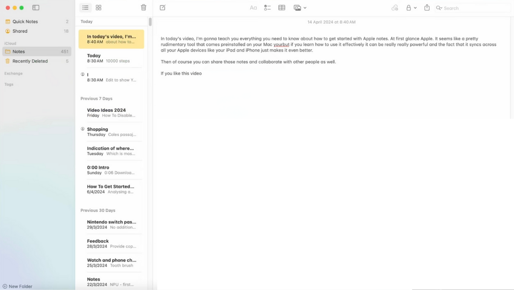
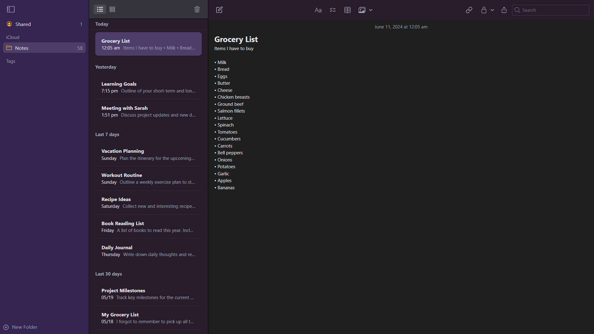
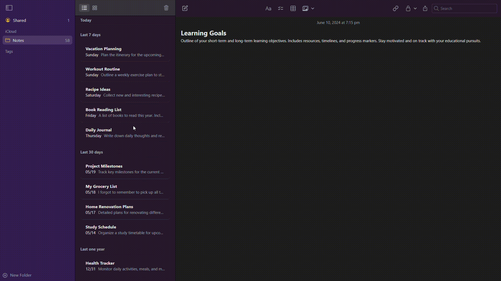

# Apple Notes Frontend

The Apple Notes application is an exact replica of the notes app for macOS. It is built using React for the frontend and Java/Spring Boot for the backend. The application performs typical notes functions and supports CRUD operations. This repository contains the backend for the application. The frontend source code can be found [here](https://github.com/Sheel-ui/apple-notes-frontend).

## Table of Contents

- [Features](#features)
- [Demo](#demo)
  - [User Interface](#our-application-interface)
  - [Notes Management](#notes-management)
- [Setup Instructions](#setup-instructions)
- [Technologies Used](#technologies-used)

## Features

- Create, Read, Update, and Delete notes
- Simple and intuitive user interface
- Responsive design

## Demo

### Original Notes Interface


### Our Application Interface



### Notes Management


## Setup Instructions

To get the backend application up and running on your local machine, follow these steps:

1. **Clone the repository:**
    ```bash
    git clone https://github.com/Sheel-ui/apple-notes-backend.git
    ```

2. **Navigate to the project directory:**
    ```bash
    cd apple-notes-backend
    ```

3. **Build the project:**
    ```bash
    ./mvnw clean install
    ```

4. **Run the application:**
    ```bash
    ./mvnw spring-boot:run
    ```

5. **Access the application:**
    - The backend API will be running at `http://localhost:8080`.


## Technologies Used

- **Frontend:** React, Tailwind (frontend source code can be found [here](https://github.com/Sheel-ui/apple-notes-frontend))
- **Backend:** Java, Spring Boot 

